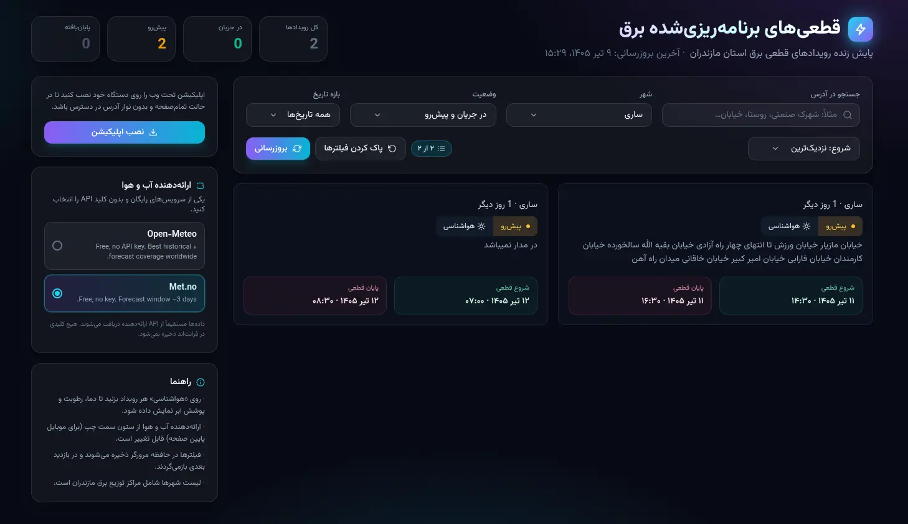

# North Outage

North Outage is a tool for monitoring and viewing electricity outage information for the north of Iran. It scrapes data from the electricity distribution company and presents it in a user-friendly web interface.



## Features

-   **Data Collection:** Automatically scrapes outage data from the official website.
-   **Web Interface:** A clean and modern web UI to view and filter outage information.
-   **Timeline View:** Visualizes outage times on a daily timeline.
-   **Filtering:** Allows filtering outages by city and address.
-   **Go Backend:** A robust backend written in Go.
-   **React Frontend:** A responsive frontend built with React and TypeScript.

## Getting Started

### Prerequisites

-   Go (version 1.25 or newer)
-   Make

### Installation & Running

1.  **Clone the repository:**
    ```bash
    git clone https://github.com/fmotalleb/north_outage.git
    cd north_outage
    ```

2.  **Configuration:**
    Copy the example configuration file:
    ```bash
    cp example/config.toml config.toml
    ```
    You can edit `config.toml` to change settings like the listening port and database path.

3.  **Build the application:**
    ```bash
    make build
    ```

4.  **Run the application:**
    ```bash
    make run
    ```
    The web server will start on the port specified in your `config.toml` (default is `:9090`).

## Configuration

Configuration is loaded from a TOML file, environment variables, and optional `.env` files.
The loader merges them in this order:

1. Config file values
2. Environment variables
3. Struct defaults defined in `config/config.go`

The app also autoloads `.env` through `github.com/joho/godotenv/autoload`.

### Config Files

- read `config/config.go` for config schema.

### Quick Start

1. Copy the sample config:
   ```bash
   cp example/config.toml config.toml
   ```
2. Edit the file or set environment variables.
3. Add bot credentials only for the integrations you actually want to run.
4. Start the app:
   ```bash
   make run
   ```

### Main Config Reference

| File key | Env var | Purpose | Example |
| --- | --- | --- | --- |
| `http_listen` | `HTTP_LISTEN` | HTTP server bind address. | `:9090` |
| `database` | `DATABASE` | Database DSN. | `sqlite:///outage.db` |
| `collect_cycle` | `COLLECT_CRON` | Cron schedule for the collector. | `@hourly` |
| `collect_timeout` | `COLLECT_TIMEOUT` | Timeout for a collection run. | `1h` |
| `collect_on_start` | `COLLECT_ON_START` | Run a collection when the service starts. | `true` |
| `collect_on_start_threshold` | `COLLECT_ON_START_THRESHOLD` | Skip startup collection if the previous run is too recent. | `10m` |
| `max_age` | `MAX_AGE` | Age limit for stored outage data. | `1h` |

Notes:

- `http_listen` controls the web server and also hosts the Mattermost command endpoints.
- `database` must be a URI, for example `sqlite:///outage.db` or a PostgreSQL DSN.
- `collect_cycle` uses cron syntax, so `@hourly` is valid.
- `collect_timeout`, `collect_on_start_threshold`, and `max_age` are parsed as Go duration strings.

### Telegram Config

Telegram is enabled when `telegram.key` or `TELEGRAM_BOT` is set.

| File key | Env var | Purpose | Example |
| --- | --- | --- | --- |
| `telegram.key` | `TELEGRAM_BOT` | Bot token from BotFather. | `123456:ABC...` |
| `telegram.timeout` | `TELEGRAM_BOT_TIMEOUT` | HTTP timeout for Telegram requests. | `30s` |
| `telegram.proxy` | `TELEGRAM_BOT_PROXY` | Optional HTTP proxy URL. | `http://127.0.0.1:7890` |
| `telegram.api` | `TELEGRAM_BOT_ENDPOINT` | Telegram API base URL. | `https://api.telegram.org` |

Telegram behavior:

- `/start` and `/help` return the help text.
- `/search <text>` searches stored outages and shows city buttons.
- `/version` prints the build version.
- Button presses create a listener for the selected city and search text.

Telegram setup:

1. Create a bot with BotFather and copy the token.
2. Set `TELEGRAM_BOT` or `telegram.key`.
3. Optionally set `TELEGRAM_BOT_TIMEOUT`, `TELEGRAM_BOT_PROXY`, and `TELEGRAM_BOT_ENDPOINT`.
4. Point your users at the bot and use `/search` to create listeners.

### Mattermost Config

Mattermost is enabled when `mattermost.bot_token` and `mattermost.server_url` are set.

| File key | Env var | Purpose | Example |
| --- | --- | --- | --- |
| `mattermost.bot_token` | `MATTERMOST_BOT_TOKEN` | Bot account token used to post notifications. | `mm-abc123...` |
| `mattermost.server_url` | `MATTERMOST_SERVER_URL` | Mattermost site URL used for REST API calls. | `https://mattermost.example.com` |
| `mattermost.public_url` | `MATTERMOST_PUBLIC_URL` | Public URL used in interactive button callbacks. | `https://bot.example.com` |
| `mattermost.command_token` | `MATTERMOST_COMMAND_TOKEN` | Optional slash-command verification token. | `secret-token` |
| `mattermost.timeout` | `MATTERMOST_TIMEOUT` | HTTP timeout for Mattermost requests. | `30s` |

Mattermost behavior:

- `POST /api/mattermost/command` handles slash commands.
- `POST /api/mattermost/action` handles interactive button callbacks.
- `/help` and `/start` return the help text.
- `/search <text>` searches stored outages and returns results with monitoring buttons.
- `/version` prints the build version.
- `/listen <city> | <search text>` can store a listener directly if you want to bypass the button flow.

Mattermost setup:

1. Create a bot account in Mattermost and generate a bot token.
2. Set `MATTERMOST_BOT_TOKEN` and `MATTERMOST_SERVER_URL`.
3. Set `MATTERMOST_PUBLIC_URL` to the public URL of this app, not the Mattermost site URL.
4. Create a custom slash command pointing to `POST /api/mattermost/command`.
5. Configure interactive message buttons to call `POST /api/mattermost/action`.
6. If you want request validation, set `MATTERMOST_COMMAND_TOKEN` and use the same token in the Mattermost slash command.

Mattermost request flow:

- `/search` posts search results with attachment buttons for cities.
- Button clicks create a listener for the selected city and search string.
- Notifications are posted back to the originating Mattermost channel.

### Example Config

`example/config.toml` is a starter config that shows the expected file layout.
It includes `example/*.toml`, so the collector config is pulled in automatically when you run with the example file.

The sample file uses comments for optional values. Un-comment only the integration blocks you need.

### Collector Config

The `collector` block is the scraper pipeline configuration consumed by `github.com/fmotalleb/scrapper-go`.
This project does not define a separate environment-variable override for that tree, so it is normally kept in TOML or YAML files.

Relevant example files:

- `example/collector.toml`
- `example/collector.yaml`

What it controls:

- browser choice and headless mode,
- navigation and scrape timeouts,
- the sequence of page interactions,
- the table extraction target,
- looped scraping over city or area selectors.

### What `example/collector.toml` Is

`example/collector.toml` is the sample collector pipeline configuration.

It defines how the scraper should visit the outage site, choose cities or areas, and extract the outage table.
It is not a bot config file. It is the scraping pipeline config consumed by the collector section in `config/config.go`.

The sample TOML currently demonstrates:

- using Chromium,
- running in non-headless mode,
- navigating to the outage site,
- looping over city options,
- selecting each city,
- scraping the outage table for each selection.

Use it as a starting point if you want to:

- change which site selectors are scraped,
- adjust timeouts or browser behavior,
- limit the collector to a specific region,
- convert the sample into your own production scraping rules.

## Tech Stack

-   **Backend:** Go
-   **Frontend:** React, TypeScript, Vite, Tailwind CSS
-   **Scraping:** Playwright
-   **Database:** SQLite (by default), Postgres

## Contributing

Contributions are welcome! Please feel free to submit a pull request.
